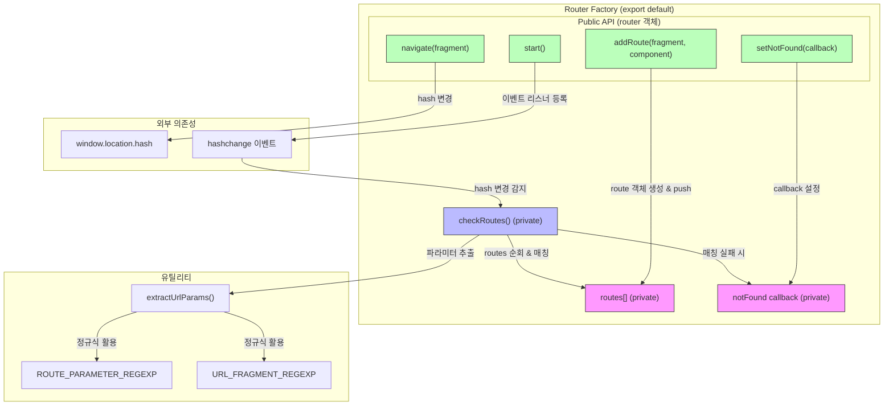
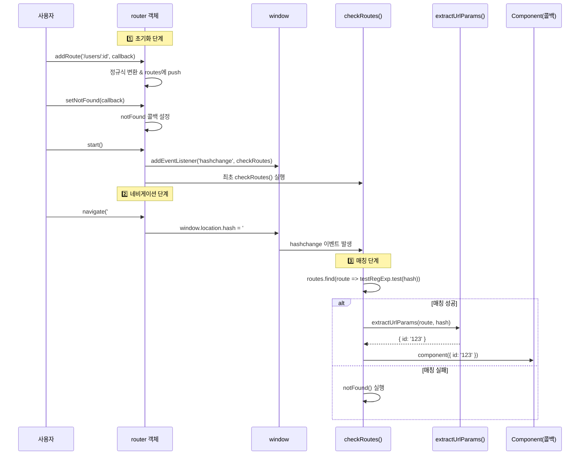
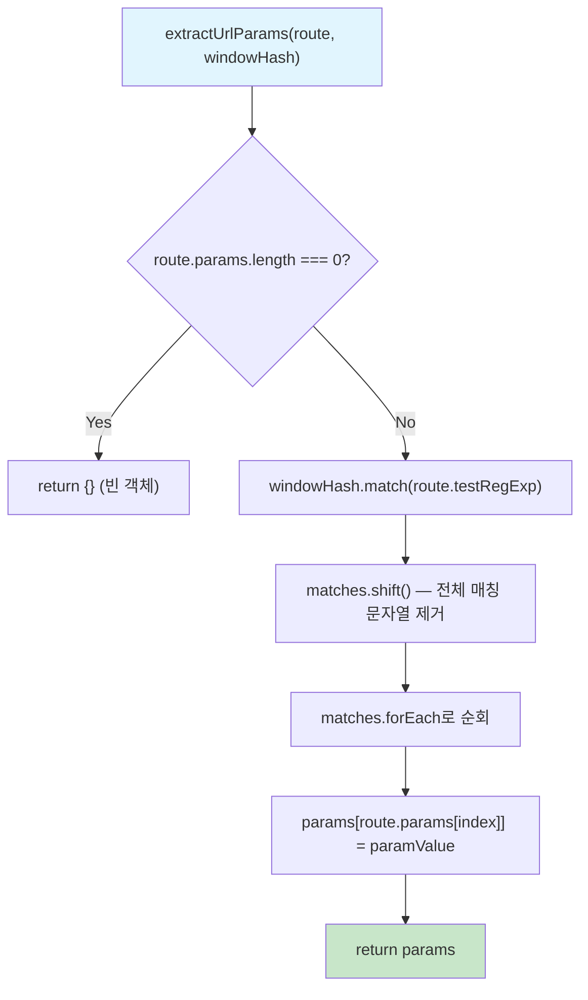
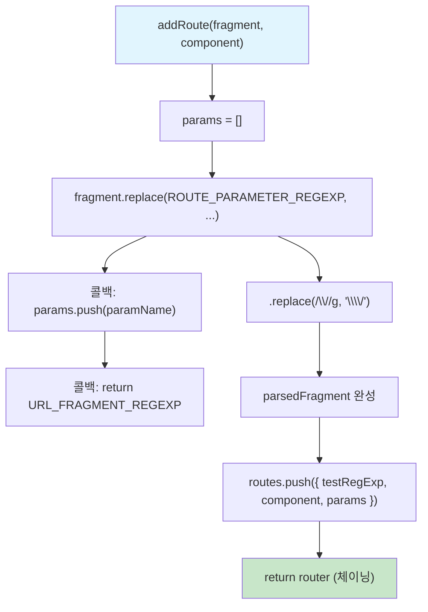
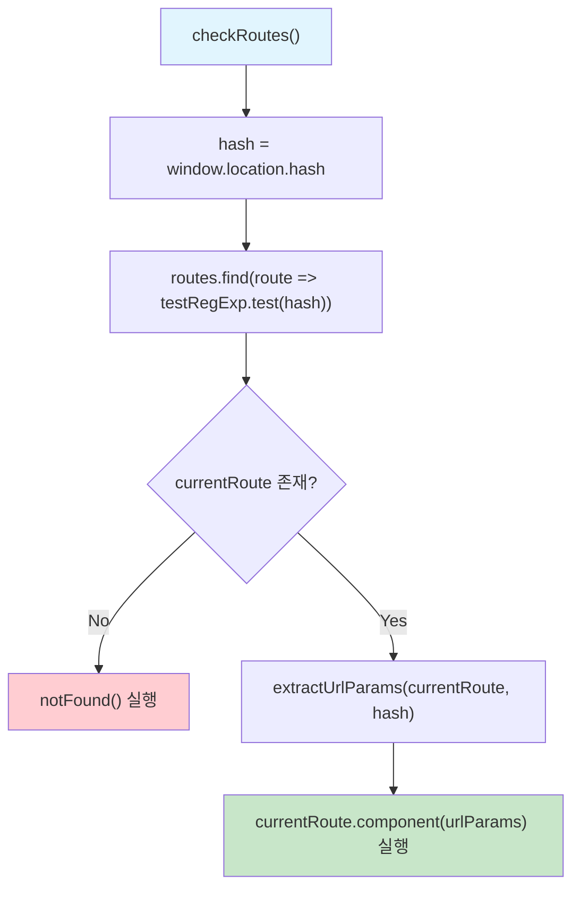
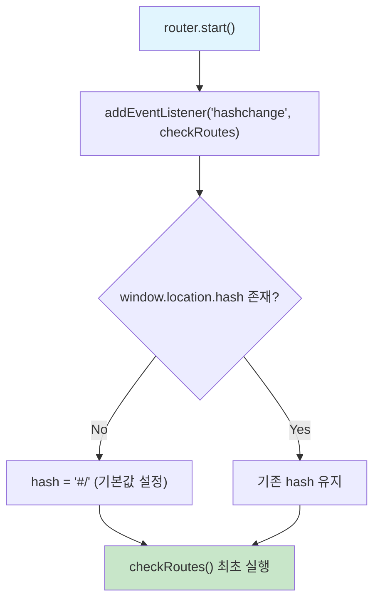
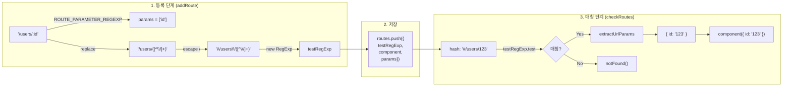
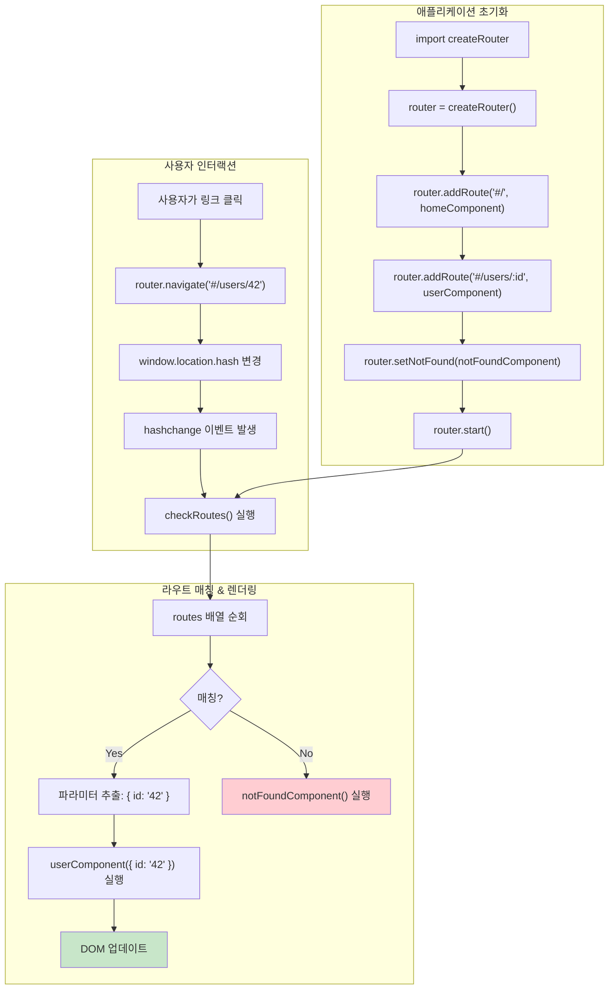
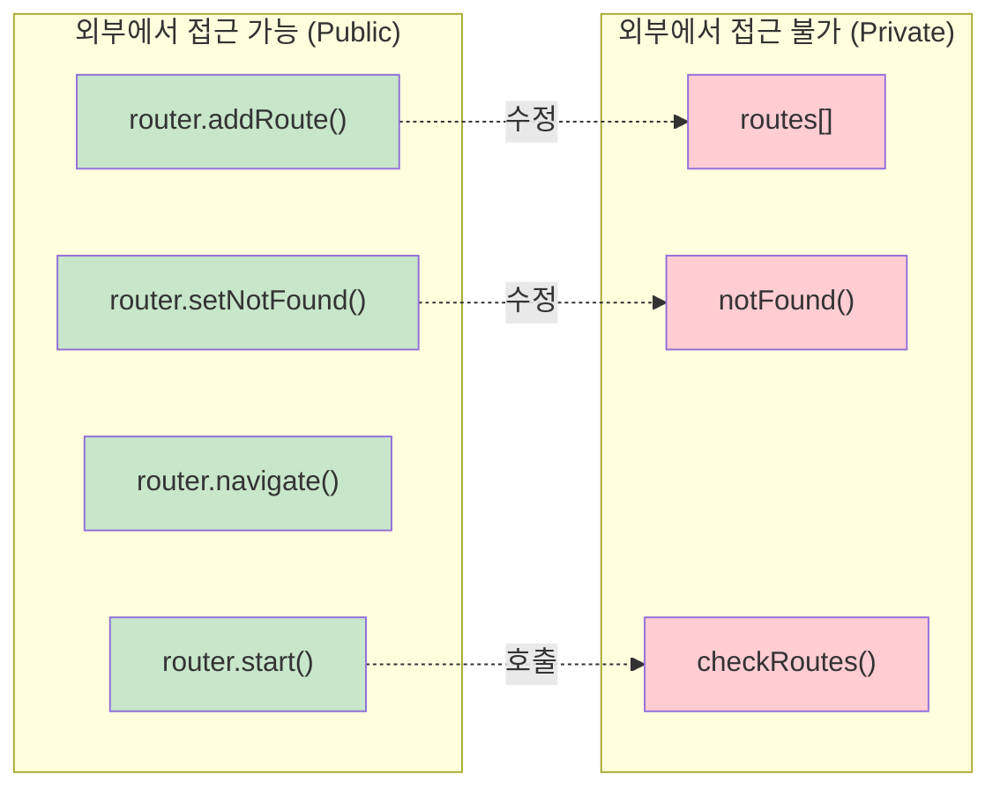

# 프레임워크 없는 Hash 기반 라우터 분석

## 목차

- [개요](#개요)
- [설계 패턴](#설계-패턴)
- [아키텍처 다이어그램](#아키텍처-다이어그램)
- [핵심 상수 및 정규식](#핵심-상수-및-정규식)
- [함수별 상세 분석](#함수별-상세-분석)
  - [extractUrlParams](#extracturlparams)
  - [router.addRoute](#routeraddroute)
  - [checkRoutes](#checkroutes)
  - [router.setNotFound](#routersetnotfound)
  - [router.navigate](#routernavigate)
  - [router.start](#routerstart)
- [라우트 등록 → 매칭 전체 흐름](#라우트-등록--매칭-전체-흐름)
- [정규식 변환 과정 상세](#정규식-변환-과정-상세)
- [활용 예시](#활용-예시)
- [핵심 설계 포인트 정리](#핵심-설계-포인트-정리)

---

## 개요

이 라우터는 **프레임워크 없이** 순수 JavaScript만으로 구현된 **Hash 기반 SPA(Single Page Application) 라우터**입니다.

`window.location.hash`의 변경을 감지하여 등록된 라우트와 매칭하고, 해당하는 컴포넌트(콜백 함수)를 실행하는 구조입니다.

### 핵심 특징

| 특징 | 설명 |
|------|------|
| **Hash 기반 라우팅** | `#/users/123` 형태의 URL fragment 활용 |
| **동적 파라미터** | `:id` 같은 동적 경로 파라미터 지원 |
| **정규식 매칭** | 라우트 패턴을 정규식으로 변환하여 URL 매칭 |
| **팩토리 패턴** | 클로저를 활용한 캡슐화된 라우터 인스턴스 생성 |
| **체이닝 API** | `addRoute().addRoute().start()` 형태 지원 |

---

## 설계 패턴

### 팩토리 패턴 + 클로저

```
export default () => {           ← 팩토리 함수
  const routes = [];             ← 클로저로 캡슐화된 private 상태
  let notFound = () => {};       ← 클로저로 캡슐화된 private 상태
  const router = {};             ← public API 객체

  router.addRoute = ...          ← public 메서드
  router.setNotFound = ...
  router.navigate = ...
  router.start = ...

  return router;                 ← public API만 외부에 노출
}
```

- `routes` 배열과 `notFound` 콜백은 **클로저** 내부에 존재하여 외부에서 직접 접근 불가
- `router` 객체에 메서드를 할당하여 **public API만 노출**
- 메서드 체이닝을 위해 `router` 객체를 반환

---

## 아키텍처 다이어그램

### 전체 라우터 구조



### 라우팅 라이프사이클



---

## 핵심 상수 및 정규식

```javascript
const ROUTE_PARAMETER_REGEXP = /:(\w+)/g;
const URL_FRAGMENT_REGEXP = '([^\\/]+)';
```

### `ROUTE_PARAMETER_REGEXP` — `/:(\w+)/g`

| 구성 요소 | 의미 |
|-----------|------|
| `:` | 콜론 리터럴 (파라미터 접두사) |
| `(\w+)` | 캡처 그룹: 하나 이상의 영숫자/밑줄 |
| `g` | 전역 플래그: 모든 매칭을 찾음 |

**역할**: `:id`, `:name` 같은 동적 파라미터를 탐지하고 이름을 추출

```
입력: '/users/:id/posts/:postId'
매칭: [':id', ':postId']
캡처: ['id', 'postId']
```

### `URL_FRAGMENT_REGEXP` — `'([^\\/]+)'`

| 구성 요소 | 의미 |
|-----------|------|
| `(` `)` | 캡처 그룹 |
| `[^\\/]` | `/` 가 아닌 모든 문자 |
| `+` | 하나 이상 |

**역할**: 파라미터 자리(:id)를 대체하여 실제 URL 값을 캡처하는 정규식 조각

---

## 함수별 상세 분석

### extractUrlParams



**목적**: URL에서 동적 파라미터 값을 추출하여 `{ paramName: paramValue }` 객체를 생성

**동작 과정 예시**:

```
route = {
  testRegExp: /^\/users\/([^\\/]+)$/,
  params: ['id']
}
windowHash = '#/users/123'

1. windowHash.match(testRegExp) → ['#/users/123', '123']
2. matches.shift()              → matches = ['123']
3. forEach 순회:
   - index=0: params['id'] = '123'
4. 결과: { id: '123' }
```

**다중 파라미터 예시**:

```
route = {
  testRegExp: /^\/users\/([^\\/]+)\/posts\/([^\\/]+)$/,
  params: ['userId', 'postId']
}
windowHash = '#/users/42/posts/7'

1. match → ['#/users/42/posts/7', '42', '7']
2. shift → ['42', '7']
3. forEach:
   - params['userId'] = '42'
   - params['postId'] = '7'
4. 결과: { userId: '42', postId: '7' }
```

---

### router.addRoute



**목적**: URL 패턴을 정규식으로 변환하여 `routes` 배열에 라우트 객체를 등록

**변환 과정 상세**:

```
입력: '/users/:id'

Step 1: ROUTE_PARAMETER_REGEXP 으로 replace
  - ':id' 매칭 → params.push('id'), return '([^\\/]+)'
  - 결과: '/users/([^\\/]+)'

Step 2: / → \\/ 이스케이프
  - 결과: '\\/users\\/([^\\/]+)'

Step 3: RegExp 생성
  - new RegExp('^' + parsedFragment + '$')
  - 결과: /^\\/users\\/([^\\/]+)$/

최종 route 객체:
{
  testRegExp: /^\\/users\\/([^\\/]+)$/,
  component: [전달받은 콜백],
  params: ['id']
}
```

---

### checkRoutes



**목적**: 현재 URL hash를 등록된 라우트들과 비교하여 매칭되는 컴포넌트를 실행

**핵심 로직**:
1. `window.location.hash` 값 가져옴 (예: `#/users/123`)
2. `routes` 배열을 순회하며 `testRegExp.test(hash)`로 매칭 시도
3. 매칭 성공 시 → 파라미터 추출 후 컴포넌트 콜백 실행
4. 매칭 실패 시 → `notFound()` 콜백 실행

---

### router.setNotFound

```javascript
router.setNotFound = (callback) => {
  notFound = callback;
  return router;
}
```

**목적**: 등록된 라우트 중 일치하는 것이 없을 때 실행할 콜백을 설정

- 클로저 변수 `notFound`를 갱신
- 체이닝을 위해 `router` 반환

---

### router.navigate

```javascript
router.navigate = fragment => {
  window.location.hash = fragment;
}
```

**목적**: 프로그래밍적으로 라우트를 이동

- `window.location.hash` 를 변경하면 자동으로 `hashchange` 이벤트가 발생
- 이벤트에 의해 `checkRoutes()` 가 트리거됨

---

### router.start



**목적**: 라우터를 활성화하고 초기 라우팅을 수행

1. `hashchange` 이벤트 리스너 등록 → 이후 hash 변경마다 `checkRoutes` 자동 실행
2. hash가 비어있으면 기본값 `#/` 설정
3. `checkRoutes()` 최초 실행으로 현재 URL에 맞는 컴포넌트 렌더링

---

## 라우트 등록 → 매칭 전체 흐름



---

## 정규식 변환 과정 상세

아래는 다양한 라우트 패턴이 정규식으로 변환되는 과정입니다.

### 단순 경로 (파라미터 없음)

```
입력:    '/'
변환:    parsedFragment = '\\/'
정규식:  /^\\/$/ 

→ '#/' 매칭 ✅
→ '#/users' 매칭 ❌
```

### 단일 파라미터

```
입력:    '/users/:id'
변환:    parsedFragment = '\\/users\\/([^\\/]+)'
정규식:  /^\\/users\\/([^\\/]+)$/
params:  ['id']

→ '#/users/123' 매칭 ✅  → { id: '123' }
→ '#/users' 매칭 ❌
→ '#/users/123/posts' 매칭 ❌
```

### 다중 파라미터

```
입력:    '/users/:userId/posts/:postId'
변환:    parsedFragment = '\\/users\\/([^\\/]+)\\/posts\\/([^\\/]+)'
정규식:  /^\\/users\\/([^\\/]+)\\/posts\\/([^\\/]+)$/
params:  ['userId', 'postId']

→ '#/users/42/posts/7' 매칭 ✅  → { userId: '42', postId: '7' }
→ '#/users/42' 매칭 ❌
```

---

## 활용 예시

### 기본 사용법

```javascript
import createRouter from './router.js'

// 1. 라우터 인스턴스 생성
const router = createRouter();

// 2. 라우트 등록 (체이닝 방식)
router
  .addRoute('#/', () => {
    // 홈 페이지 렌더링
    document.body.innerHTML = '<h1>홈</h1>';
  })
  .addRoute('#/users', () => {
    // 사용자 목록 페이지
    document.body.innerHTML = '<h1>사용자 목록</h1>';
  })
  .addRoute('#/users/:id', (params) => {
    // 사용자 상세 페이지
    document.body.innerHTML = `<h1>사용자 #${params.id}</h1>`;
  })
  .addRoute('#/users/:userId/posts/:postId', (params) => {
    // 특정 사용자의 특정 게시물
    document.body.innerHTML = `
      <h1>사용자 #${params.userId}의 게시물 #${params.postId}</h1>
    `;
  })
  .setNotFound(() => {
    // 404 페이지
    document.body.innerHTML = '<h1>404 - 페이지를 찾을 수 없습니다</h1>';
  })
  .start(); // 라우터 시작
```

### 프로그래밍적 네비게이션

```javascript
// 버튼 클릭 시 페이지 이동
document.querySelector('#userLink').addEventListener('click', () => {
  router.navigate('#/users/42');
});

// 조건부 리다이렉트
function checkAuth() {
  if (!isLoggedIn) {
    router.navigate('#/login');
  }
}
```

### Todo 앱과 함께 사용하는 예시

```javascript
import createRouter from '../router/router.js'
import { renderTodos } from './view/todos.js'
import { renderFilters } from './view/filters.js'

const state = {
  todos: [],
  currentFilter: 'All',
};

const router = createRouter();

router
  .addRoute('#/', () => {
    state.currentFilter = 'All';
    render();
  })
  .addRoute('#/active', () => {
    state.currentFilter = 'Active';
    render();
  })
  .addRoute('#/completed', () => {
    state.currentFilter = 'Completed';
    render();
  })
  .setNotFound(() => {
    router.navigate('#/');
  })
  .start();
```

### 활용 흐름도



---

## 핵심 설계 포인트 정리

### 1. 클로저를 활용한 상태 캡슐화



### 2. Hash 기반 라우팅의 장점

| 장점 | 설명 |
|------|------|
| **서버 설정 불필요** | `#` 이후 부분은 서버로 전송되지 않음 |
| **호환성** | 모든 브라우저에서 지원 |
| **단순한 구현** | `hashchange` 이벤트만으로 SPA 라우팅 구현 |
| **새로고침 안전** | hash 포함 URL로 새로고침해도 동작 |

### 3. 개선 가능한 부분

| 항목 | 현재 | 개선 방안 |
|------|------|-----------|
| **라우팅 방식** | Hash 기반 (`#/`) | History API (`pushState`) |
| **가드 기능** | 없음 | `beforeEach`, `afterEach` 훅 추가 |
| **중첩 라우트** | 미지원 | 재귀적 라우트 매칭 구조 |
| **쿼리스트링** | 미지원 | `?key=value` 파싱 추가 |
| **라우트 제거** | 미지원 | `removeRoute` 메서드 추가 |
| **비동기 컴포넌트** | 미지원 | `async component` 지원 |
