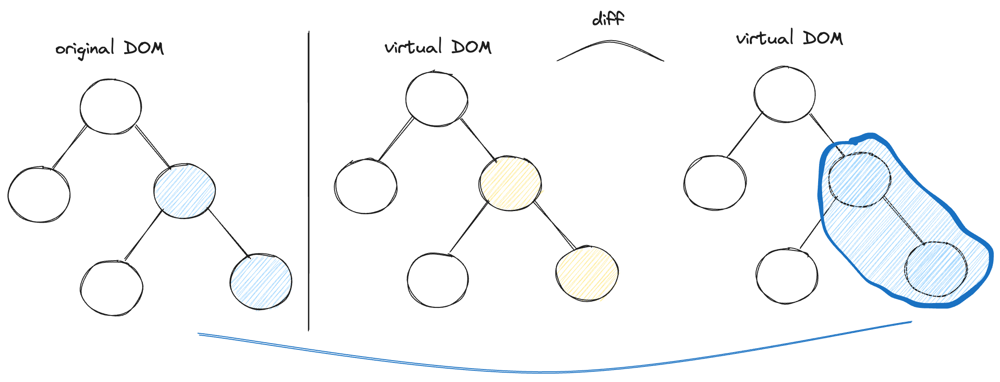
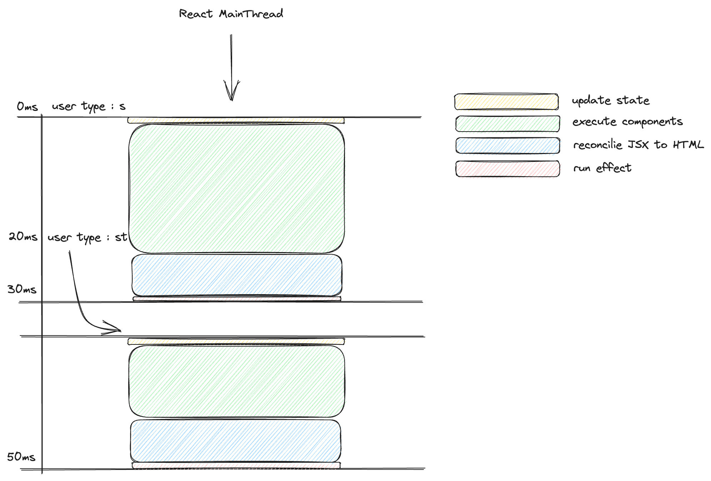
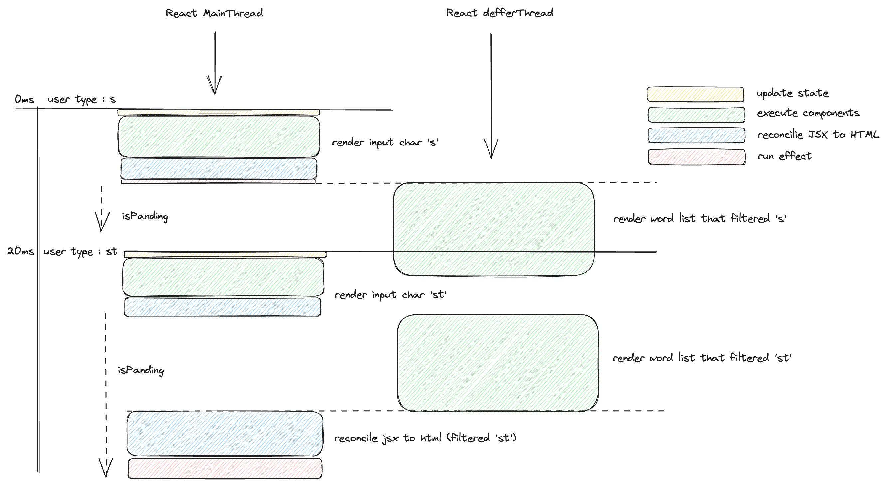
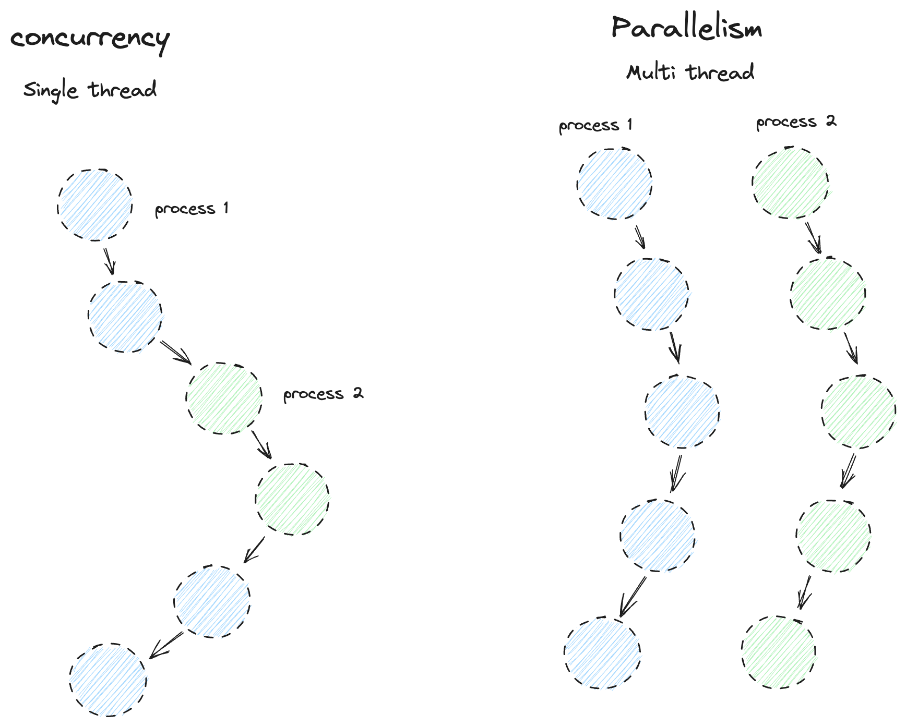

### 스레드

스레드란 실행 흐름의 최소단위이다. 예를 들면 카카오톡을 실행시킬 때, 메시지를 받는 역할을 하는 스레드가 있고, 메시지를 보내는 역할을 하는 녀석과 매 화면을 업데이트 하는 스레드가 있다. 이런식으로 하나의 프로세스에는 여러 스레드가 각자의 역할에 따라 수행한다. <br />

다른 예시라면 어떠한 수 배열에 대한 누적합을 구하는 과정에서도 하나의 배열을 누적합하는 하나의 스레드만 이용하는 방법과, 배열을 쪼갠 다음 promise 를 통해 2,3개의 스레드로 나누어서 작업하는 방식이 있다. 속도는 스레드를 나눠서 하는 쪽이 더 빠르다. <br />

```js
function main() {
  const arr = Array(1).fill(Number.MAX_SAFE_INTEGER);
  console.time("main"); // 시간 시작지점

  const result = arr.reduce((acc, num) => acc + num, 0);
  console.log(result);

  console.timeEnd("main"); // 0.2203...ms
}

function sum(numberArray) {
  return new Promise((resolve) => {
    resolve(numberArray.reduce((acc, num) => acc + num, 0));
  });
}

async function asyncMain() {
  const arr = Array(1).fill(Number.MAX_SAFE_INTEGER);

  let mid = Math.ceil(arr.length / 2);
  let firstHalf = arr.slice(0, mid);
  let secondHalf = arr.slice(mid);

  console.time("asyncMain"); // 시간 시작지점

  const [first, second] = await Promise.all([sum(firstHalf), sum(secondHalf)]);
  console.log(first + second);

  console.timeEnd("asyncMain"); // 0ms
}

main();
asyncMain();
```

<br />

다만 리엑트는 하나의 스레드만 활용하는데, 브라우저에서 스레드를 하나밖에 사용하지 않기 때문이다. 기본적으로 리엑트의 렌더링 과정은 크게 4번의 과정을 거치게 된다. <br />

- state 값이 변경된다
- 이후 virtual DOM 간의 diff 를 통해 변경사항을 파악한다
- reconcile 과정을 통해 jsx 를 html 로 변경한다 (즉, 실제 DOM에 적용한다)
- 컴포넌트가 렌더링 된 이후 effect 가 실행이 된다. (effect 에 따라 위 과정 반복)

<br />



<br />

실제 예시를 통해 확인해보면, 현 레포지토리 내부에 App.js 에 예시 코드가 작성되어있으니 참고!

### 싱글 스레드로 인한 리엑트의 최적화 문제

예제 코드는 수많은 단어의 조합이 나오고, input 창에다가 문자를 입력하면 그 문자에 해당하는 부분이 하이라이트 되는 간단한 filter 어플리케이션이다. 우선 왜 문제가 발생하는지 처리 과정을 그림으로 살펴보도록 하자 <br />



<br />

하나의 스레드로서 최종적으로 리엑트가 렌더되기까지의 과정을 나타낸다. 예를 들어 입력창에 's' 를 입력하게 되면, 우선 상태값이 's' 로 변경되고, 이후 많은 단어 배열들 중에서 's' 에 해당하는 부분을 찾은 뒤 이에 해당하는 하이라이트 과정을 거친다(렌더링). 이후 reconcile 과정을 통해 jsx -> html 로 parse 한 뒤 실제 DOM 에 적용하고 마지막에 effect 를 진행한다. 즉 실제 렌더화면이 나타나려면 filter 된 단어 배열의 데이터가 모두 반영되어야 하기에, 실제 어플리케이션을 작동해보면 입력 마다 즉각적으로 화면이 변경되는것이 아니라 끊킴이 발생함을 알 수 있다. <br />

```jsx
// 문제가 되는 부분은 이 로직이다.
// FilterWords.jsx

// .. 생략
const [filter, setFilter] = useState("");
const handleChange = ({ target: { value } }) => {
  setFilter(value); // filter 된 값이 그대로 Words 에 들어가게 된다.
};

return (
  <main>
    <label>
      Filter:
      <input type='search' value={filter} onChange={handleChange} />
    </label>
    <Words list={list} filter={Filter} />
  </main>
);
```

<br />

이를 해결하기 위해서는 스레드를 증가시키는 방법인 useTransition 이 있다. 우선적으로 렌더링 해야할 부분을 렌더링 한 뒤, 그 이후 작업해야 하는 부분을 작업하고, 작업 결과물에 대한 렌더링을 진행하게 된다. 아래 그림으로 과정을 보면 위와 차이가 있음을 알 수 있다. <br />



<br />

우선 가장 먼저 렌더해야할 input 창에 typing 된 's' 를 렌더링한다. 이후 이 상태로 filter 된 데이터 처리를 이후로 넘긴다. (이로인한 딜레이가 isPanding). 만일 's' 에 대한 필터렌더과정이 진행중에, 사용자가 'st' 를 입력해버리면 진행중인 필터과정을 멈추고 다시 input 창에 'st' 를 우선적으로 렌더링한다. 그 다음 'st' 에 대한 필터 렌더링 과정을 처리한 뒤, 더 이상 입력값의 변화가 없기에 reconcile 과정을 거쳐 최종 화면을 렌더링 하게 된다. <br />

```jsx
// FilterWords.jsx

// .. 생략
const [filter, setFilter] = useState("");
const [deferedFilter, setDeferedFilter] = useState("");

const [isPanding, startTransition] = useTransition();

const handleChange = ({ target: { value } }) => {
  setFilter(value); // filter 된 값이 그대로 Words 에 들어가게 된다.

  startTransition(() => {
    setDeferedFilter(value);
  });
};

return (
  <main>
    <label>
      Filter:
      <input type='search' value={filter} onChange={handleChange} />
    </label>
    {isPanding ? (
      <p>Loading...</p>
    ) : (
      <Words list={list} filter={deferedFilter} />
    )}
  </main>
);
```

<br />

(이 과정을 이해하기 전에 먼저 concurrency 에 대해 살펴보는게 좋다. 아래 그림을 통해 확인해보자) <br />



<br />

(concurrency 는 process 1을 진행하다가 2로 전환되고 다시 1로 전환되는 방식을 취하게 된다.)
