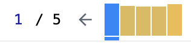
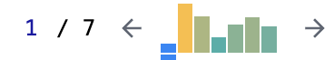

### 스레드

스레드란 실행 흐름의 최소단위이다. 예를 들면 카카오톡을 실행시킬 때, 메시지를 받는 역할을 하는 스레드가 있고, 메시지를 보내는 역할을 하는 녀석과 매 화면을 업데이트 하는 스레드가 있다. 이런식으로 하나의 프로세스에는 여러 스레드가 각자의 역할에 따라 수행한다. <br />

다른 예시라면 어떠한 수 배열에 대한 누적합을 구하는 과정에서도 하나의 배열을 누적합하는 하나의 스레드만 이용하는 방법과, 배열을 쪼갠 다음 promise 를 통해 2,3개의 스레드로 나누어서 작업하는 방식이 있다. 속도는 스레드를 나눠서 하는 쪽이 더 빠르다. <br />

```js
function main() {
  const arr = Array(1).fill(Number.MAX_SAFE_INTEGER);
  console.time("main"); // 시간 시작지점

  const result = arr.reduce((acc, num) => acc + num, 0);
  console.log(result);

  console.timeEnd("main"); // 0.2203...ms
}

function sum(numberArray) {
  return new Promise((resolve) => {
    resolve(numberArray.reduce((acc, num) => acc + num, 0));
  });
}

async function asyncMain() {
  const arr = Array(1).fill(Number.MAX_SAFE_INTEGER);

  let mid = Math.ceil(arr.length / 2);
  let firstHalf = arr.slice(0, mid);
  let secondHalf = arr.slice(mid);

  console.time("asyncMain"); // 시간 시작지점

  const [first, second] = await Promise.all([sum(firstHalf), sum(secondHalf)]);
  console.log(first + second);

  console.timeEnd("asyncMain"); // 0ms
}

main();
asyncMain();
```

<br />

다만 리엑트는 하나의 스레드만 활용하는데, 브라우저에서 스레드를 하나밖에 사용하지 않기 때문이다. 기본적으로 리엑트의 렌더링 과정은 크게 4번의 과정을 거치게 된다. <br />

- state 값이 변경된다
- 이후 virtual DOM 간의 diff 를 통해 변경사항을 파악한다
- reconcile 과정을 통해 jsx 를 html 로 변경한다 (즉, 실제 DOM에 적용한다)
- 컴포넌트가 렌더링 된 이후 effect 가 실행이 된다. (effect 에 따라 위 과정 반복)

<br />


<br />

실제 예시를 통해 확인해보면, 현 레포지토리 내부에 App.js 에 예시 코드가 작성되어있으니 참고!

### 싱글 스레드로 인한 리엑트의 최적화 문제

예제 코드는 수많은 단어의 조합이 나오고, input 창에다가 문자를 입력하면 그 문자에 해당하는 부분이 하이라이트 되는 간단한 filter 어플리케이션이다. 우선 왜 문제가 발생하는지 처리 과정을 그림으로 살펴보도록 하자 <br />


<br />

하나의 스레드로서 최종적으로 리엑트가 렌더되기까지의 과정을 나타낸다. 예를 들어 입력창에 's' 를 입력하게 되면, 우선 상태값이 's' 로 변경되고, 이후 많은 단어 배열들 중에서 's' 에 해당하는 부분을 찾은 뒤 이에 해당하는 하이라이트 과정을 거친다(렌더링). 이후 reconcile 과정을 통해 jsx -> html 로 parse 한 뒤 실제 DOM 에 적용하고 마지막에 effect 를 진행한다. 즉 실제 렌더화면이 나타나려면 filter 된 단어 배열의 데이터가 모두 반영되어야 하기에, 실제 어플리케이션을 작동해보면 입력 마다 즉각적으로 화면이 변경되는것이 아니라 끊킴이 발생함을 알 수 있다. <br />

```jsx
// 문제가 되는 부분은 이 로직이다.
// FilterWords.jsx

// .. 생략
const [filter, setFilter] = useState("");
const handleChange = ({ target: { value } }) => {
  setFilter(value); // filter 된 값이 그대로 Words 에 들어가게 된다.
};

return (
  <main>
    <label>
      Filter:
      <input type='search' value={filter} onChange={handleChange} />
    </label>
    <Words list={list} filter={Filter} />
  </main>
);
```

<br />

이를 해결하기 위해서는 스레드를 증가시키는 방법인 useTransition 이 있다. 우선적으로 렌더링 해야할 부분을 렌더링 한 뒤, 그 이후 작업해야 하는 부분을 작업하고, 작업 결과물에 대한 렌더링을 진행하게 된다. 아래 그림으로 과정을 보면 위와 차이가 있음을 알 수 있다. <br />


<br />

우선 가장 먼저 렌더해야할 input 창에 typing 된 's' 를 렌더링한다. 이후 이 상태로 filter 된 데이터 처리를 이후로 넘긴다. (이로인한 딜레이가 isPanding). 만일 's' 에 대한 필터렌더과정이 진행중에, 사용자가 'st' 를 입력해버리면 진행중인 필터과정을 멈추고 다시 input 창에 'st' 를 우선적으로 렌더링한다. 그 다음 'st' 에 대한 필터 렌더링 과정을 처리한 뒤, 더 이상 입력값의 변화가 없기에 reconcile 과정을 거쳐 최종 화면을 렌더링 하게 된다. <br />

```jsx
// FilterWords.jsx

// .. 생략
const [filter, setFilter] = useState("");
const [deferedFilter, setDeferedFilter] = useState("");

const [isPanding, startTransition] = useTransition();

const handleChange = ({ target: { value } }) => {
  setFilter(value); // filter 된 값이 그대로 Words 에 들어가게 된다.

  startTransition(() => {
    setDeferedFilter(value);
  });
};

return (
  <main>
    <label>
      Filter:
      <input type='search' value={filter} onChange={handleChange} />
    </label>
    {isPanding ? (
      <p>Loading...</p>
    ) : (
      <Words list={list} filter={deferedFilter} />
    )}
  </main>
);
```

<br />

(이 과정을 이해하기 전에 먼저 concurrency 에 대해 살펴보는게 좋다. 아래 그림을 통해 확인해보자) <br />


<br />

(concurrency 는 process 1을 진행하다가 2로 전환되고 다시 1로 전환되는 방식을 취하게 된다.)

### React.Memo

이미 계산된 값에 대해서 매번 반복해서 계산하기보단 메모이제이션을 통해 이미 저장된 값을 그대로 사용하게 된다면 효율적일 것이다. 현 리엑트는 함수형 컴포넌트이며 함수라는 것에 알 수 있듯이, 반환값이 있고 이 반환값을 메모이제이션 할 수 있다. 이렇게 했을 경우 렌더링에서 효율성이 발휘 될 수 있다. 이전 useTransition 을 도입하기 전의 검색 애플리케이션으로 살펴보도록 하자. <br />

```jsx
const Word = ({ name, highlight = "" }) => {
  const letters = name.split("");
  return (
    <li>
      {letters.map((l, i) => (
        <span className={highlight.includes(l) ? "h" : ""} key={i}>
          {l}
        </span>
      ))}
    </li>
  );
};

const Words = function Words({ list, filter }) {
  return (
    <ul>
      {list.map((name) => (
        <Word key={name} name={name} highlight={filter} />
      ))}
    </ul>
  );
};

export default Words;
```

<br />

이전 예시와 동일하게 fetch 를 통해 받아온 단어 list 에 특정 문자에 대한 하이라이트를 작성하는 컴포넌트이다. 단어 리스트중에 속하는 단어들 중 검색 결과와 무관한 단어들은 메모이제이션 될 경우 훨씬 렌더링 결과가 좋아질 수 있겠다. <br />

렌더링 성능은 구글 크롬 내 profiler 라는 리엑트 전용 애플리케이션에서 확인할 수 있다. 사용법은 간단하니 찾아보면 금방 나온다. 렌더링이 어떠한 순서로 어떠한 원인떄문에 발생했는지, 그 속도는 얼마인지를 한눈에 확인할 수 있다. <br />

우선 메모이제이션 하지 않고 매 검색 결과마다 렌더링을 할 경우의 렌더링 성능은 아래와 같다. <br />



<br />

막대그래프의 높이가 높을 수록 렌더링 시 시간이 걸린다는 의미이다. 전체적으로 높은 수준이라는 것을 알 수 있다. 이제 React.Memo 를 도입헤보도록 하자. 우선 도입하기전에 현재 어떠한 상태에 의해 렌더링되는 word 가 재렌더링 되어야 하는지부터 알아야 한다. 새롭게 렌더링이 되려면 결국 하이라이트 부분이 변해야 한다. 즉, 하이라이트 부분에 변화가 없다면 이전의 메모리에 저장된 값을 사용해도 문제가 없다. <br />

```jsx
const Word = React.memo(
  ({ name, highlight = "" }) => {
    const letters = name.split("");
    return (
      <li>
        {letters.map((l, i) => (
          <span className={highlight.includes(l) ? "h" : ""} key={i}>
            {l}
          </span>
        ))}
      </li>
    );
  },
  (prevProps, nextProps) => {
    // 이전값과 다음값의 차이를 계산하기 위해 2가지 인자를 받는다.
    const letters = prevProps.name.split("");
    // 'aahed' -> ['a', 'a', 'h', 'e', 'd']
    // 모든 문자가 이전 상태와 같다면 메모이제이션을 하게 된다.
    return letters.every((l) => {
      return (
        nextProps.highlight.includes(l) === prevProps.highlight.includes(l)
      );
    });
  }
);
```

<br />

위와 같이 메모이제이션 했을 경우, 렌더링 성능은 아래처럼 된다. <br />



<br />

물론 메모이제이션은 현 예제처럼 복잡한 다루는 데이터가 많을 경우 사용하도록 하자. 어찌되었던 메모리를 사용하는것이기 때문이다.

### useMemo

React.memo 와 마찬가지로 메모이제이션을 통해 렌더링의 효율을 증가시켜준다. 다른 예시를 통해 살펴보자 <br />

```jsx
let appRender = 0;
export default function PocketMon() {
  const [pokemon, setPokemon] = useState([]);
  const [threshold, setThreshold] = useState(0);
  const [search, setSearch] = useState("");
  const [dummy, setDummy] = useState("");
  const onSetSearch = useCallback((evt) => setSearch(evt.target.value), []);

  useEffect(() => {
    getByName(search).then(setPokemon);
  }, [search]);

  console.time("render"); // 시간 측정 시작점
  const pokemonWithPower = () =>
    pokemon
      .map((p) => ({
        ...p,
        power: calculatePower(p),
      }))
      .filter((p) => p.power >= threshold);
  const onSetThreshold = useCallback(
    (evt) => setThreshold(parseInt(evt.target.value, 10)),
    []
  );

  const countOverThreshold = () =>
    pokemonWithPower.filter((p) => p.power > threshold).length;

  const min = () => Math.min(...pokemonWithPower.map((p) => p.power));
  const max = () => Math.max(...pokemonWithPower.map((p) => p.power));

  console.timeEnd("render"); // 시간 측정 끝

  return (
    <div>
      <div className='top-bar'>
        <div>Search</div>
        <input type='text' value={search} onChange={onSetSearch}></input>
        <div>Power threshold</div>
        <input
          type='text'
          value={threshold || 0}
          onChange={onSetThreshold}
        ></input>
        <input
          type='text'
          value={dummy}
          onChange={(e) => setDummy(e.target.value)}
        />
        <div>Count over threshold: {countOverThreshold}</div>
      </div>
      <div className='two-column'>
        <MemoedPokemonTable pokemon={pokemonWithPower} />
        <div>
          <div>Min: {min}</div>
          <div>Max: {max}</div>
        </div>
      </div>
    </div>
  );
}
```

<br />

코드가 조금 긴 편인데, 우선 useMemo 와 React.memo 의 차이점을 생각해보자. 둘 다 반환값을 메모이징 한다는 점에서는 같은데, React.memo 의 경우 함수 컴포넌트 내 반환값이 렌더링 부분에 대한 메모이징이며, useMemo 는 함수 내 로직에서의 계산값에 대한 메모이징이라고 생각하면 된다. 위 예시는 이를 잘 보여주는데, console.time 부터 해서 console.timeend 까지의 여러 계산값이 저장되는 변수들이 이에 해당한다. <br />

코드에서 보면 setDummy 라고 해서 현재 컴포넌트에 어떠한 기능도 하지않지만, 상태값을 변화시키기에 렌더링을 유발하는 dummy 상태값을 조절하는 이벤트가 바인딩 되어있다. 즉 저 input 창에 타이핑을 할 때마다 계속해서 렌더링은 발생하게 되고, 함수가 재 실행된다는 것은 내부 변수 및 반환식들이 다시 실행된다는 것을 의미한다. 이때 렌더링이 될 때 시간을 console.time 으로 기록할 수 있는데, 이때 시간이 useMemo 를 사용할때와 아닐 때와의 차이를 보게 되면 확실히 차이가 발생한다.<br />

아래 코드는 useMemo 를 통해 계산된 반환값을 메모이징 한 코드이다. <br />

```jsx
export default function PocketMon() {
  const [pokemon, setPokemon] = useState([]);
  const [threshold, setThreshold] = useState(0);
  const [search, setSearch] = useState("");
  const [dummy, setDummy] = useState("");
  const onSetSearch = useCallback((evt) => setSearch(evt.target.value), []);

  useEffect(() => {
    getByName(search).then(setPokemon);
  }, [search]);

  console.time("render");
  const pokemonWithPower = useMemo(
    // useMemo 를 통해 반환값을 변화시킬 수 있는 변수 pokemon 과 threshold 의 변화가 없다면 같은 값!
    () =>
      pokemon
        .map((p) => ({
          ...p,
          power: calculatePower(p),
        }))
        .filter((p) => p.power >= threshold),
    [pokemon, threshold]
  );
  const onSetThreshold = useCallback(
    // useCallback 의 경우는 반환함수를 메모이징 해준다고 생각하면 된다. 객체는 언제나 원시값이 아니니 매번 다르다.
    (evt) => setThreshold(parseInt(evt.target.value, 10)),
    []
  );

  const countOverThreshold = useMemo(
    () => pokemonWithPower.filter((p) => p.power > threshold).length,
    [pokemonWithPower, threshold]
  );

  const min = useMemo(
    () => Math.min(...pokemonWithPower.map((p) => p.power)),
    [pokemonWithPower]
  );
  const max = useMemo(
    () => Math.max(...pokemonWithPower.map((p) => p.power)),
    [pokemonWithPower]
  );

  console.timeEnd("render"); // 실제 시간을 측정 시 useMemo 를 사용했을 때 0.00ms 대로 떨어지게 된다.

  return (
    <div>
      <div className='top-bar'>
        <div>Search</div>
        <input type='text' value={search} onChange={onSetSearch}></input>
        <div>Power threshold</div>
        <input
          type='text'
          value={threshold || 0}
          onChange={onSetThreshold}
        ></input>
        <input
          type='text'
          value={dummy}
          onChange={(e) => setDummy(e.target.value)}
        />
        <div>Count over threshold: {countOverThreshold}</div>
      </div>
      <div className='two-column'>
        <MemoedPokemonTable pokemon={pokemonWithPower} />
        <div>
          <div>Min: {min}</div>
          <div>Max: {max}</div>
        </div>
      </div>
    </div>
  );
}
```
